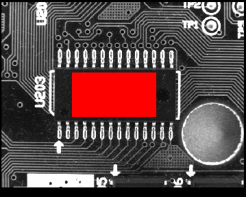
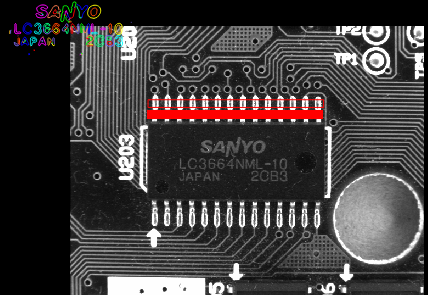
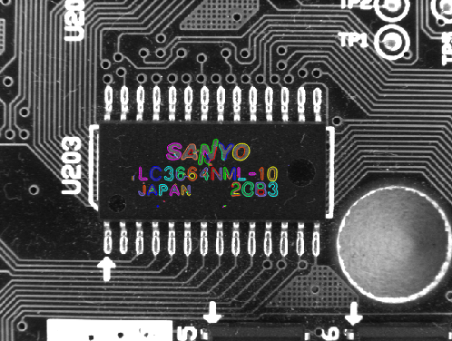
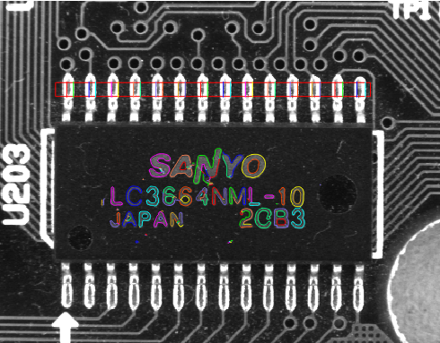
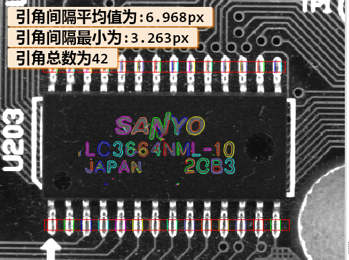
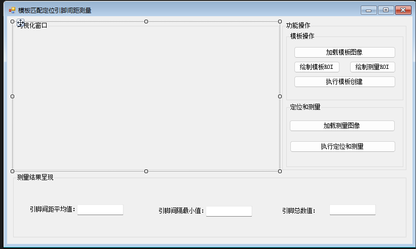

# 模板匹配定位+引脚间距测量及个数统计实现
## 步骤
### 一、创建图像模板
读取第一张图像作为创建模板的图像  
获取图像宽和高 get_image_size  
获取创建模板的区域 gen_rectangle1  
获取矩形的中心坐标 area_center  
  
显示图像的模板区域图像 reduce_domain  
把显示区域作为图像模板进行模板创建 create_shape_model  
获取创建模板的轮廓 get_shape_model_contours  
生成区域跟随 gen_rectangle2  
生成XLD跟随 gen_rectangle2_contour_xld  
  
### 二、开始进行模板定位测量
获取窗口句柄 dev_get_window  
创建仿射变换矩阵 hom_mat2d_identity  
遍历图片  
    读取带测量的图像  
    进行模板匹配定位 find_shape_model  
    使用仿射变换矩阵进行平移和旋转 hom_mat2d_translate hom_mat2d_rotate  
    仿射变换模板的轮廓到对应图像位置 affine_trans_contour_xld  
    进行跟随区域及轮廓仿射变换,刚体变换矩阵(旋转过程中必须固定一个点进行操作) vector_angle_to_rigid  
      
    仿射变换跟随轮廓 affine_trans_contour_xld  
    获取轮廓中心点 area_center_xld  
    生成测量标线 gen_measure_rectangle2  
    生成成对的测量标线 measure_pairs  
    显示 disp_line  
  
      

### 三、导出C#文件
使用正则匹配
''' .+\.Dispose\(\);
删除带dispose的

### 四、搭建界面编写C#逻辑
  
导入halcon依赖,halcondotnet,在bin\dotnet35目录下
可视化窗口显示
''' 
private void Form1_Load(object sender, EventArgs e)
{
    //创建一个halcon控件对象
    hwControl = new HSmartWindowControl();
    //设置控件以填充方式放入到父容器中
    hwControl.Dock = DockStyle.Fill;
    //添加到对应容器中
    panel1.Controls.Add(hwControl);

} 
'''

